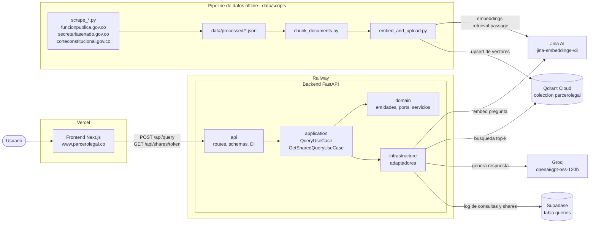
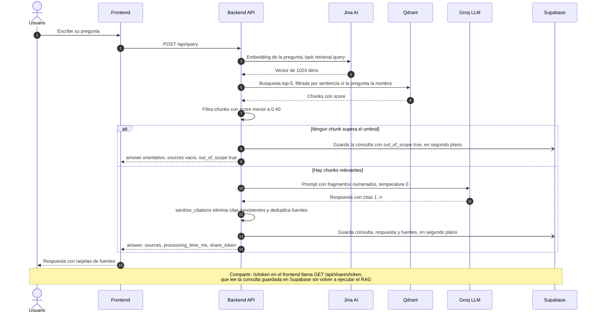

# Parcerolegal.co

Buscador legal colombiano gratuito. Haces una pregunta en español natural y recibes una respuesta generada por IA, **citando los fragmentos reales de la legislación** de donde sale (RAG: _Retrieval Augmented Generation_). Si la pregunta cae fuera del corpus, el sistema lo dice en vez de inventar.

Producción: **https://www.parcerolegal.co**

Corpus actual (~16k chunks en Qdrant):

| Fuente | Chunks |
|---|---|
| Constitución Política de Colombia (1991) | 691 |
| 25 sentencias clave de la Corte Constitucional (T-760/08, C-355/06, SU-214/16, T-025/04, …) | 12 072 |
| Código Penal (parte general, delitos y penas) | 738 |
| Código Sustantivo del Trabajo | 481 |
| Código Civil completo (2 684 artículos, 2 036 con texto vigente) | 2 085 |

---

## Arquitectura



El backend sigue una arquitectura por capas (DDD / puertos y adaptadores): `domain` no depende de nada externo; `application` orquesta los casos de uso contra los _ports_ del dominio; `infrastructure` implementa esos ports (Jina, Qdrant, Groq, Supabase); `api` expone HTTP y hace la inyección de dependencias.

### Flujo de una consulta



## Estructura del repositorio

```
parcerolegal/
├── backend/
│   ├── app/
│   │   ├── domain/          # Entidades, ports (interfaces) y servicios puros:
│   │   │                    #   umbral de similitud, sanitize_citations, detección de área legal
│   │   ├── application/     # Casos de uso: query_use_case, get_shared_query_use_case
│   │   ├── infrastructure/  # Adaptadores: jina_embedder, qdrant_store, groq_llm,
│   │   │                    #   supabase_query_log_store, background_query_log_store, config
│   │   └── api/             # FastAPI: main (app, CORS, /api/health), routes, dependencies, schemas
│   ├── migrations/          # SQL de Supabase (tabla queries, share_token), aplicar en orden
│   ├── tests/               # pytest, espeja las 4 capas
│   └── requirements.txt
├── data/
│   ├── scripts/             # scrape_* → chunk_documents → embed_and_upload
│   ├── processed/           # JSON limpios y chunks.json (versionados en git)
│   ├── raw/                 # HTML descargados (gitignored)
│   ├── tests/               # pytest del pipeline, con fixtures HTML
│   └── requirements.txt
├── frontend/                # Next.js (App Router) + Tailwind CSS
│   ├── app/                 # page.tsx (buscador), about/, s/[id]/ (respuesta compartida)
│   ├── components/          # SearchBox, ResultPanel, SourceCard, ShareButton, …
│   └── lib/                 # api.ts (cliente del backend), types.ts
├── docs/                    # PRD y planes de diseño
├── .github/workflows/       # CI: tests del backend en cada push/PR
├── railway.toml             # Comando de arranque y healthcheck de Railway
└── requirements.txt         # Dependencias que instala Railway
```

## Stack

| Capa | Tecnología |
|---|---|
| Frontend | Next.js 16 (App Router), React 19, Tailwind CSS 4, Jest + Testing Library |
| Backend | Python 3.11, FastAPI + Uvicorn, pydantic-settings |
| LLM | `openai/gpt-oss-120b` vía Groq (temperature 0, `reasoning_effort: low`, max 1024 tokens) |
| Embeddings | `jina-embeddings-v3` vía Jina AI (1024 dims; `retrieval.query` / `retrieval.passage`) |
| Vector DB | Qdrant Cloud, colección `parcerolegal`, top-k 5, umbral de similitud 0.40 |
| Persistencia | Supabase (PostgREST), tabla `queries`: log de consultas y respuestas compartidas |
| Hosting | Vercel (frontend) + Railway (backend) |

## Desarrollo local

Requisitos: Python 3.11 y Node.js 20+.

### Backend

Desde la raíz del repo (los imports son `backend.app...`):

```bash
python -m venv .venv && source .venv/bin/activate
pip install -r backend/requirements.txt

# crea un .env en la raíz con las variables de la sección siguiente
uvicorn backend.app.api.main:app --reload --port 8000

pytest backend/tests/ -v
```

Sin credenciales de Supabase el backend funciona igual: simplemente no guarda consultas y `GET /api/shares/{token}` responde 503.

### Frontend

```bash
cd frontend
npm install
npm run dev     # http://localhost:3000, apunta a http://localhost:8000 por defecto
npm test        # Jest
npm run build
```

### Pipeline de datos

Solo hace falta correrlo para cambiar el corpus; `data/processed/` ya está versionado. Se ejecuta desde la raíz:

```bash
pip install -r data/requirements.txt

python data/scripts/scrape_constitucion.py
python data/scripts/scrape_sentencias.py
python data/scripts/scrape_codigo_penal.py
python data/scripts/scrape_codigo_sustantivo_trabajo.py
python data/scripts/scrape_codigo_civil.py  # ~84 páginas de secretariasenado.gov.co, cacheadas en data/raw/codigo_civil/
python data/scripts/chunk_documents.py     # → data/processed/chunks.json (800–1000 chars, overlap 150)
python data/scripts/embed_and_upload.py    # embebe con Jina y hace upsert en Qdrant

pytest data/tests/ -v
```

`embed_and_upload.py` acepta `EMBED_SOURCE_TYPES` (p. ej. `codigo_penal,codigo_sustantivo_trabajo` o `codigo_civil`) para subir solo algunas fuentes, y `START_BATCH` para reanudar una carga interrumpida.

## Variables de entorno

**Backend** (`.env` en la raíz o variables de Railway; ver `backend/app/infrastructure/config.py`):

| Variable | Uso |
|---|---|
| `GROQ_API_KEY` | LLM |
| `JINA_API_KEY` | Embeddings |
| `QDRANT_URL`, `QDRANT_API_KEY` | Vector DB |
| `SUPABASE_URL`, `SUPABASE_KEY` | Log de consultas y compartir (opcionales) |
| `ENVIRONMENT` | `development` por defecto; se expone en `/api/health` |

Opcionales con default en `Settings`: `TOP_K`, `LLM_MODEL`, `LLM_TEMPERATURE`, `LLM_MAX_TOKENS`, `EMBEDDING_MODEL`, `EMBEDDING_DIMENSIONS`, `QDRANT_COLLECTION`, `SUPABASE_QUERIES_TABLE`.

**Frontend** (Vercel o `frontend/.env.local`):

| Variable | Uso |
|---|---|
| `NEXT_PUBLIC_API_URL` | URL del backend (default `http://localhost:8000`) |

**Pipeline de datos**: `JINA_API_KEY`, `QDRANT_URL`, `QDRANT_API_KEY` (y opcionalmente `EMBED_SOURCE_TYPES`, `START_BATCH`).

## Deploy

- **Backend → Railway**: se despliega automáticamente con cada push a `main` mediante la integración nativa de Railway con GitHub. `railway.toml` define el arranque (`uvicorn backend.app.api.main:app --host 0.0.0.0 --port $PORT`) y el healthcheck en `/api/health`.
- **Frontend → Vercel**: integración de Vercel con GitHub (no hay config en el repo); push a `main` despliega producción. Configura `NEXT_PUBLIC_API_URL` en el proyecto de Vercel.
- **CI**: `.github/workflows/ci-cd.yml` corre `pytest backend/tests/` en cada push y en cada PR contra `main`.
- **Base de datos**: las migraciones de `backend/migrations/` se aplican a mano en Supabase, en orden numérico.
